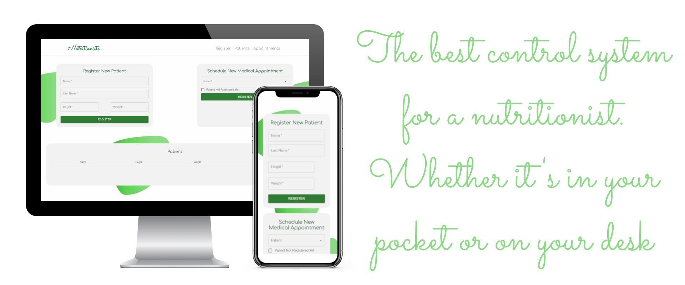

<h1 align=center>Nutritionist System 👩‍⚕️🍎</h1>

My first React WebApp, learning more about function components, hooks and how a Single Page Application works and can be more interactire with the user.

  

<!--
   * [Features](#-Features)
   * [Pré Requisitos](#-Pré-requisitos)
   * [Como Instalar](#-Como-Instalar)
      * [Deploy Aplicação](#-Como-Instalar)
      * [Executando em Servidor Local](#Inicializando-o-TomCat)
      * [Possíveis Erros](#Você-pode-se-deparar-com-o-erro-UnsuportClassVersionError)
   * [Como Utilizar](#-Como-Utilizar)
   * [Construção](#-Construção)
   * [Testes](#-Testes)
   * [Tecnologias](#-Tecnologias)
   * [Autores](#-Autor)
-->

### ✅ Features

- [x] Patient Registration
- [x] Extensive Patient Record
- [x] History of Medical Appointments
- [x] Visualization in Graphics
- [ ] Search Patient
- [ ] Form Control
- [ ] Local Storage Feature

## ❗ Prerequisites

Before starting, you will need to have the following tools installed on your machine:
- [Git](https://git-scm.com/book/en/v2/Getting-Started-Installing-Git)
- [NodeJS](https://nodejs.org/en/)
- [Browser](https://www.google.pt/intl/pt-PT/chrome/?brand=ISCS&gclid=CjwKCAjwzOqKBhAWEiwArQGwaF25v-VaQJSALRBqH-VUgY9rpQn0rzYFtoB_etqEkmLqKnmSWtynmRoC_nEQAvD_BwE&gclsrc=aw.ds)
- [Code Editor (Recommended)](https://code.visualstudio.com)

## 💻 How to Run

In the project directory, you can run:

### `npm start`

Runs the app in the development mode.\
Open [http://localhost:3000](http://localhost:3000) to view it in the browser.

The page will reload if you make edits.\
You will also see any lint errors in the console.

### `npm run build`

Builds the app for production to the `build` folder.\
It correctly bundles React in production mode and optimizes the build for the best performance.

The build is minified and the filenames include the hashes.\
Your app is ready to be deployed!

## ⌨ How to Use

### Patient Sign
You can make as many entries as you want. Once done, the patient will be included in the list below, where it is possible to consult all the records, with the possibility of changing the information or deleting the records that you deem necessary.

### See Each of Them in the List
It is possible to view the record of any patient and search for a specific name.

### See your Query History and Your Progress in a Graph
By expanding the list, you have access to more details about the patient. Your complete record, your result in the consultation history and a graphical view of your progress.

## 🛠 Technologies

The following tools were used in the construction of the project:

- JavaScript
- React
   - Material UI
   - Styled Components
   - React Router
- HTML5
- CSS3

## 💻 Autores

### Gabriel Duarte 🧑‍💻

 

 
